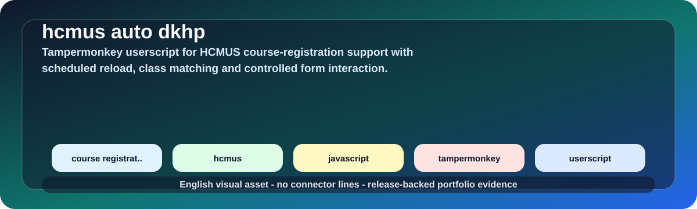

# HCMUS Course Registration Userscript

  
  
  

  

## Overview

This repository contains a Tampermonkey userscript that assists HCMUS course-registration workflows through scheduled reload, class matching and controlled form interactions.

| Field | Details |
|---|---|
| Repository | [hcmus-auto-dkhp](https://github.com/lhlizdabezt/hcmus-auto-dkhp) |
| Portfolio category | Browser userscript and student-tooling repository |
| Primary stack | JavaScript, Tampermonkey, browser automation, userscript workflows, HCMUS course-registration support. |
| Latest release | [GitHub Releases](https://github.com/lhlizdabezt/hcmus-auto-dkhp/releases/latest) |
| Tags | [Version tags](https://github.com/lhlizdabezt/hcmus-auto-dkhp/tags) |
| Owner profile | [Luong Hai Long](https://github.com/lhlizdabezt) |

## Reviewer Map

| What to Review | Where to Look | Why It Matters |
|---|---|---|
| Technical scope | This README and source tree | Gives a quick, bounded reading path before opening every file |
| Evidence assets | Release page and top-level project files | Shows what can be downloaded or inspected quickly |
| Implementation material | Source folders, scripts, notebooks or design files | Connects the portfolio claim to real project artifacts |
| Version history | Tags and release notes | Makes the repository easier to audit over time |

## Evidence Highlights

- Scheduled reload and course/class matching logic.
- Course checkbox support and optional submit flow.
- Manual CAPTCHA boundary kept explicit.
- Userscript release history and browser-automation evidence.

## Repository Structure

| Path | Purpose |
|---|---|
| `tricker/` | Top-level directory included in the repository |
| `CHANGELOG.md` | Top-level file included in the repository |
| `LICENSE` | Top-level file included in the repository |

## Scope and Boundaries

Student productivity tool. It does not bypass CAPTCHA or platform rules; manual steps remain manual where required.

## Role and Portfolio Context

Luong Hai Long maintains this as a practical browser-automation project.

## Release and Tagging Notes

This repository is maintained as part of an English-facing engineering portfolio. Releases and tags are used to preserve reviewable snapshots of the project, including source state, documentation updates and any available visual or report assets.

## Writing Standard

The README follows an evidence-first style: direct technical nouns, clear project boundaries, release-backed artifacts and no inflated claims beyond what the repository can support.
